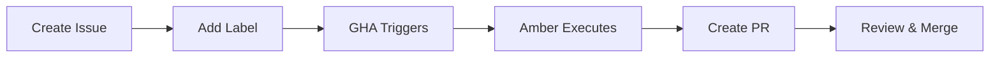

# Ambient Code Techniques Inventory

**Repository**: `github.com/ambient-code/reference`  
**Purpose**: Reference implementation demonstrating Ambient Code concepts for maximum agent productivity and issue-to-PR automation

This document catalogs all techniques, patterns, and automation discovered across Ambient Code repositories, with a focus on productivity enhancements and agent performance optimization.

---

## Table of Contents

1. [Issue-to-PR Automation (Amber)](#issue-to-pr-automation-amber)
2. [GitHub Actions Workflows](#github-actions-workflows)
3. [Agent Orchestration Patterns](#agent-orchestration-patterns)
4. [Workflow Templates](#workflow-templates)
5. [CLAUDE.md Patterns](#claudemd-patterns)
6. [Code Quality Automation](#code-quality-automation)
7. [Security Patterns](#security-patterns)
8. [Productivity Multipliers](#productivity-multipliers)

---

## Issue-to-PR Automation (Amber)

### Overview

**Amber** is a background agent that automatically converts GitHub issues into pull requests. This is the **core productivity multiplier** - team members can trigger automated fixes without direct access to Claude Code.

### How It Works



### Trigger Mechanisms

1. **Labels** (Primary):
   - `amber:auto-fix` - Low-risk formatting/linting fixes
   - `amber:refactor` - Medium-risk refactoring
   - `amber:test-coverage` - Add missing tests

2. **Comments** (Alternative):
   - `/amber execute` - Execute proposal in issue
   - `@amber` - Mention Amber to trigger

### Workflow Implementation

**File**: `.github/workflows/amber-issue-handler.yml`

**Key Features**:
- ✅ Prevents duplicate PRs (checks for existing PRs)
- ✅ Creates sanitized branch names: `amber/issue-{number}-{sanitized-title}`
- ✅ Handles race conditions (PR closed during execution)
- ✅ Security: Validates branch names, prevents injection
- ✅ Retry logic with exponential backoff for API calls
- ✅ Comprehensive error handling and notifications

**Security Practices**:
- All user input passed via environment variables (no command injection)
- Branch name validation with regex: `^[a-zA-Z0-9/_.-]+$`
- Issue number validation (numeric only)
- Minimal token permissions: `contents:write`, `issues:write`, `pull-requests:write`

### Issue Format Requirements

For Amber to work effectively, structure issues like this:

```markdown
## Problem
[Describe what needs to be fixed]

## Files
File: `path/to/file.go`
File: `path/to/another.py`

## Instructions
[Step-by-step instructions for Amber]

## Success Criteria
- [ ] All linters pass
- [ ] All tests pass
- [ ] Follows CLAUDE.md standards
```

**Key Fields**:
- `File:` or `Path:` - Amber extracts file paths automatically
- `Instructions:` or `Task:` - Main instructions section
- Success criteria checklist

### Risk-Based Automation Policies

**Configuration**: `.claude/amber-config.yml`

| Risk Level | Actions | Auto-Merge | Examples |
|------------|---------|------------|----------|
| **Low** | Auto-fix, create PR | No (requires review) | Formatting, linting |
| **Medium** | Create PR with proposal | No | Refactoring, test additions |
| **High** | Report only, no PR | N/A | Breaking changes, security issues |

### Amber Categories

**Auto-Fix (Low Risk)**:
- Code formatting (gofmt, black, prettier)
- Linting violations
- Unused import removal
- Documentation formatting

**Refactoring (Medium Risk)**:
- Breaking large files into modules
- Extracting repeated patterns
- Replacing `context.TODO()` with proper context
- Improving error handling

**Test Coverage (Medium Risk)**:
- Adding missing unit tests
- Contract tests for API endpoints
- Edge case coverage
- Improving test coverage percentage

### Safety Guardrails

```yaml
safety:
  max_auto_prs_per_day: 5
  max_files_per_auto_pr: 10
  require_review_for_auto_merge: true
  never_push_to_main: true
  always_create_branch: true
```

### Monitoring & Reporting

- Daily: Check recent commits, run linting, verify CI status
- Weekly: Full codebase health check, test coverage analysis
- Monthly: Architecture review, technical debt assessment

---

## GitHub Actions Workflows

### Core Workflows

#### 1. Amber Issue Handler (`amber-issue-handler.yml`)

**Purpose**: Convert issues to PRs via Amber agent

**Triggers**:
- Issue labeled: `amber:auto-fix`, `amber:refactor`, `amber:test-coverage`
- Issue comment: `/amber execute` or `@amber`

**Steps**:
1. Extract issue details (files, instructions)
2. Create Amber agent prompt
3. Check for existing PR (prevent duplicates)
4. Create/checkout feature branch
5. Execute Claude Code CLI
6. Check for changes
7. Push branch and create/update PR
8. Report results

**Key Implementation Details**:
- Uses `envsubst` for safe variable substitution
- Validates all inputs (issue numbers, branch names)
- Handles race conditions (PR closed during execution)
- Retry logic for transient API failures
- Comprehensive error reporting

#### 2. Claude Code Review (`claude-code-review.yml`)

**Purpose**: Automated code reviews on pull requests

**Triggers**:
- `@claude` mention in PR comments
- Pull request review comments

**Features**:
- Minimizes old review comments automatically
- Supports fork PRs
- Comprehensive review covering:
  - Code quality & best practices
  - Security vulnerabilities
  - Performance bottlenecks
  - Testing adequacy
  - Architecture & design
  - Documentation

**Review Format**:
```markdown
# Claude Code Review

## Summary
[Brief overview]

## Issues by Severity
### 🚫 Blocker Issues
### 🔴 Critical Issues
### 🟡 Major Issues
### 🔵 Minor Issues

## Positive Highlights
## Recommendations
```

#### 3. Components Build & Deploy (`components-build-deploy.yml`)

**Purpose**: Build and deploy platform components

**Features**:
- Change detection (only builds modified components)
- Multi-platform builds (linux/amd64, linux/arm64)
- Conditional registry push (main branch only)
- Component-specific tests

**Change Detection**:
- Frontend: `components/frontend/**`
- Backend: `components/backend/**`
- Operator: `components/operator/**`
- Runner: `components/runners/**`

#### 4. E2E Tests (`e2e.yml`)

**Purpose**: End-to-end testing in Kind cluster

**Features**:
- Full stack deployment
- Cypress UI testing
- Authentication testing
- Ingress routing validation

#### 5. Dependabot Auto-Merge (`dependabot-auto-merge.yml`)

**Purpose**: Automatically merge safe dependency updates

**Behavior**:
- Auto-merges patch/minor updates after CI passes
- Requires manual review for major updates
- Only for Dependabot PRs

#### 6. Amber Dependency Sync (`amber-dependency-sync.yml`)

**Purpose**: Daily sync of dependency versions to Amber knowledge base

**Behavior**:
- Runs daily at scheduled time
- Updates Amber's understanding of current dependencies
- Helps Amber make better decisions about updates

#### 7. Amber Auto Review (`amber-auto-review.yml`)

**Purpose**: Automatic code reviews on PRs (complement to manual @claude reviews)

**Behavior**:
- Runs on all PRs automatically
- Provides initial review before human review
- Uses same review format as manual reviews

### Workflow Best Practices

**Security**:
- ✅ Use environment variables for user input
- ✅ Validate all inputs (regex, type checking)
- ✅ Minimal permissions per workflow
- ✅ Never interpolate user input in `run:` commands

**Reliability**:
- ✅ Retry logic with exponential backoff
- ✅ Handle race conditions gracefully
- ✅ Comprehensive error reporting
- ✅ Timeout limits (prevent runaway jobs)

**Monitoring**:
- ✅ Link to workflow runs in comments
- ✅ Log all decisions for audit trail
- ✅ Report failures to issues

---

## Agent Orchestration Patterns

### Amber - Workflow Orchestrator

**Role**: Single point of contact, intelligent agent coordinator

**Capabilities**:
- Automatically invokes appropriate specialists
- Proactive engagement (brings in experts without explicit requests)
- Adaptive complexity handling
- Complete ecosystem access

**Specialists Amber May Engage**:
- **Stella (Staff Engineer)** - Complex debugging, architecture
- **Neil (Test Engineer)** - Testing strategies, automation
- **Taylor (Team Member)** - Straightforward implementations
- **secure-software-braintrust** - Security assessment
- **sre-reliability-engineer** - Performance, reliability
- **Terry (Technical Writer)** - Documentation
- **Any other platform agents** as needed

### Agent Personas

Located in `.claude/agents/` or `workflows/agent-bullpen/`:

**Architecture & Engineering**:
- `archie-architect.md` - System architecture
- `stella-staff_engineer.md` - Complex technical problems
- `taylor-team_member.md` - Implementation support

**Product & Management**:
- `parker-product_manager.md` - Product requirements
- `olivia-product_owner.md` - Feature ownership
- `jack-delivery_owner.md` - Delivery management

**Testing & Quality**:
- `neil-test_engineer.md` - Test strategies
- `phoenix-pxe_specialist.md` - PXE/Infrastructure testing

**UX & Design**:
- `aria-ux_architect.md` - UX architecture
- `steve-ux_designer.md` - UI design
- `ryan-ux_researcher.md` - User research

**Content & Documentation**:
- `terry-technical_writer.md` - Technical writing
- `tessa-writing_manager.md` - Content strategy

**Management**:
- `dan-senior_director.md` - Strategic direction
- `emma-engineering_manager.md` - Engineering management
- `lee-team_lead.md` - Team leadership
- `sam-scrum_master.md` - Agile facilitation

### Agent Invocation Patterns

**Explicit Invocation**:
```
"Invoke Stella to analyze this architectural issue"
```

**Implicit (Amber Orchestration)**:
```
"Fix this bug" → Amber automatically engages Neil for testing, Stella for complex parts
```

**Multi-Agent Collaboration**:
```
Feature development → Parker (requirements) → Archie (architecture) → Taylor (implementation) → Neil (testing)
```

---

## Workflow Templates

### Spec Kit Workflow

**Purpose**: Specification-first feature development

**Phases**:
1. `/specify` - Create detailed feature specifications
2. `/plan` - Generate technical implementation plans
3. `/tasks` - Break down into actionable tasks
4. `/implement` - Execute the implementation
5. `/analyze` - Review and analyze outcomes

**Structure**:
```
workflows/spec-kit/
├── .specify/               # Workflow configuration
│   ├── scripts/           # Automation scripts
│   ├── templates/         # Document templates
│   └── memory/           # Workflow knowledge base
└── .claude/              # Claude AI configuration
    ├── agents/           # Agent personas
    └── commands/         # Slash commands
```

### Bug Fix Workflow

**Purpose**: Systematic bug resolution

**Phases**:
1. `/reproduce` - Systematically reproduce bug
2. `/diagnose` - Root cause analysis
3. `/fix` - Implement fix
4. `/test` - Verify fix and create regression tests
5. `/document` - Create complete documentation

**Artifacts Generated**:
- `artifacts/bugfix/reports/reproduction.md`
- `artifacts/bugfix/analysis/root-cause.md`
- `artifacts/bugfix/fixes/implementation-notes.md`
- `artifacts/bugfix/tests/verification.md`
- `artifacts/bugfix/docs/` (issue-update, release-notes, changelog, etc.)

**Agent Recommendations**:
- Complex bugs → Stella (Staff Engineer)
- Testing → Neil (Test Engineer)
- Straightforward → Taylor (Team Member)

### Template Workflow

**Purpose**: Base structure for custom workflows

**Components**:
- Field reference documentation
- Template structure
- Example commands

---

## CLAUDE.md Patterns

### Memory System - Loadable Context

**Concept**: Structured context files instead of monolithic CLAUDE.md

**Structure**:
```
.claude/
├── context/              # Task-specific context
│   ├── backend-development.md
│   ├── frontend-development.md
│   └── security-standards.md
├── patterns/            # Code patterns
│   ├── error-handling.md
│   ├── k8s-client-usage.md
│   └── react-query-usage.md
└── repomix-guide.md     # Architecture view usage
```

**Usage Pattern**:
```
"Claude, load the architecture view and backend-development context,
then help me add a new endpoint"
```

### Architecture Decision Records (ADRs)

**Location**: `docs/adr/`

**Purpose**: Document WHY decisions were made

**Format**:
- `0001-kubernetes-native-architecture.md`
- `0002-user-token-authentication.md`
- `0003-multi-repo-support.md`
- etc.

### Repomix Integration

**Purpose**: Single architecture view for all tasks

**File**: `repomix-analysis/03-architecture-only.xml`

**Benefits**:
- Grade 8.8/10 architecture view
- 187K tokens of context
- Single view approach (vs. 7 views)
- Consistent context across all tasks

**Usage**:
- Load architecture view for all architectural questions
- Reference in context files
- Guide in `.claude/repomix-guide.md`

---

## Code Quality Automation

### Pre-Commit Hooks

**Configuration**: `.pre-commit-config.yaml`

**Language-Specific**:
- **Python**: black, isort, ruff
- **JavaScript**: prettier, eslint
- **Go**: gofmt, golangci-lint

**Installation**:
```bash
pre-commit install
```

### Automated Linting

**Workflows**:
- `go-lint.yml` - Go formatting, vetting, linting
- `frontend-lint.yml` - ESLint, TypeScript checking

**Behavior**:
- Runs on all PRs
- Blocks merge if failures
- Auto-fix suggestions via Amber

### Test Coverage

**Requirements**:
- Minimum thresholds per component
- Coverage reports in CI
- Amber can add missing tests (`amber:test-coverage`)

### Code Review Automation

**Two-Tier System**:
1. **Amber Auto Review** - Automatic on all PRs
2. **Claude Manual Review** - On-demand via `@claude`

**Review Focus Areas**:
- Code quality & best practices
- Security vulnerabilities
- Performance bottlenecks
- Testing adequacy
- Architecture & design
- Documentation

---

## Security Patterns

### Token Handling

**Pattern**: Never log tokens, always redact

```go
// ✅ Good
log.Printf("Processing request with token (len=%d)", len(token))

// ❌ Bad
log.Printf("Token: %s", token)
```

### Input Validation

**Pattern**: Validate all user inputs

```yaml
# ✅ Good - Validate before use
if ! [[ "$ISSUE_NUMBER" =~ ^[0-9]+$ ]]; then
  echo "Error: Invalid issue number"
  exit 1
fi

# ❌ Bad - Use directly
echo "$ISSUE_NUMBER"
```

### Branch Name Sanitization

**Pattern**: Sanitize and validate branch names

```bash
SANITIZED_TITLE=$(echo "$ISSUE_TITLE" \
  | tr '[:upper:]' '[:lower:]' \
  | sed 's/[^a-z0-9-]/-/g' \
  | sed 's/--*/-/g' \
  | sed 's/^-//' \
  | sed 's/-$//' \
  | cut -c1-50)

# Validate
if ! [[ "$BRANCH_NAME" =~ ^[a-zA-Z0-9/_.-]+$ ]]; then
  echo "Error: Invalid branch name"
  exit 1
fi
```

### RBAC Enforcement

**Pattern**: Always check permissions before operations

```go
// Check permissions
ssar := &authv1.SelfSubjectAccessReview{
  Spec: authv1.SelfSubjectAccessReviewSpec{
    ResourceAttributes: &authv1.ResourceAttributes{
      Group:     "vteam.ambient-code",
      Resource:  "agenticsessions",
      Verb:      "list",
      Namespace: project,
    },
  },
}
res, err := reqK8s.AuthorizationV1().SelfSubjectAccessReviews().Create(ctx, ssar, v1.CreateOptions{})
if err != nil || !res.Status.Allowed {
  c.JSON(http.StatusForbidden, gin.H{"error": "Unauthorized"})
  return
}
```

---

## Productivity Multipliers

### 1. Issue-to-PR Automation

**Impact**: 10x productivity for routine tasks

**Use Cases**:
- Formatting fixes → Instant PR
- Linting violations → Automated fix
- Test coverage gaps → Auto-generated tests
- Documentation updates → Quick PRs

**Time Savings**: 
- Before: 15-30 min per task (create branch, fix, test, PR)
- After: 2-5 min (create issue, review PR)

### 2. Automated Code Reviews

**Impact**: Catch issues before human review

**Benefits**:
- Consistent review standards
- 24/7 availability
- Catches security issues early
- Reduces reviewer fatigue

### 3. Agent Orchestration

**Impact**: Right expertise at the right time

**Benefits**:
- No need to manually select agents
- Automatic escalation for complex issues
- Multi-agent collaboration
- Consistent quality

### 4. Workflow Templates

**Impact**: Standardized processes

**Benefits**:
- Consistent output quality
- Faster onboarding
- Reusable patterns
- Best practices built-in

### 5. Context-Aware Development

**Impact**: Faster context loading

**Benefits**:
- Load only relevant context
- Faster response times
- Better accuracy
- Reduced token usage

### 6. Automated Dependency Management

**Impact**: Always up-to-date dependencies

**Benefits**:
- Security patches applied automatically
- No manual dependency updates
- Amber stays current with versions
- Reduced technical debt

---

## Implementation Checklist

For `github.com/ambient-code/reference`:

### Phase 1: Core Infrastructure

- [ ] Initialize git repository
- [ ] Set up GitHub repository (`ambient-code/reference`)
- [ ] Create basic README.md
- [ ] Add CLAUDE.md with memory system structure

### Phase 2: Amber Automation

- [ ] Create `.github/workflows/amber-issue-handler.yml`
- [ ] Create `.claude/amber-config.yml`
- [ ] Create issue templates:
  - [ ] `.github/ISSUE_TEMPLATE/amber-auto-fix.yml`
  - [ ] `.github/ISSUE_TEMPLATE/amber-refactor.yml`
  - [ ] `.github/ISSUE_TEMPLATE/amber-test-coverage.yml`
- [ ] Test Amber workflow with sample issue

### Phase 3: Code Quality Automation

- [ ] Create `.pre-commit-config.yaml`
- [ ] Create `.github/workflows/go-lint.yml` (if Go)
- [ ] Create `.github/workflows/frontend-lint.yml` (if JS/TS)
- [ ] Set up test coverage reporting

### Phase 4: Code Review Automation

- [ ] Create `.github/workflows/claude-code-review.yml`
- [ ] Create `.github/workflows/amber-auto-review.yml`
- [ ] Test review workflows

### Phase 5: Documentation

- [ ] Create `docs/adr/` directory
- [ ] Create `.claude/context/` directory with context files
- [ ] Create `.claude/patterns/` directory with pattern files
- [ ] Document all workflows in `.github/workflows/README.md`

### Phase 6: Workflow Templates

- [ ] Create `workflows/bugfix/` template
- [ ] Create `workflows/spec-kit/` template (optional)
- [ ] Document workflow usage

### Phase 7: Agent Personas

- [ ] Create `.claude/agents/` directory
- [ ] Add key agent personas (Stella, Neil, Taylor, etc.)
- [ ] Document agent usage patterns

---

## Key Takeaways

1. **Issue-to-PR is the killer feature** - Amber automation provides 10x productivity gains
2. **Security is built-in** - All workflows follow security best practices
3. **Agent orchestration scales** - Amber automatically brings in the right expertise
4. **Context matters** - Structured context files beat monolithic CLAUDE.md
5. **Automation everywhere** - From linting to reviews to dependency updates
6. **Workflows standardize** - Templates ensure consistency and quality
7. **Monitoring is essential** - Track everything, learn from failures

---

## Next Steps

1. **Review this inventory** - Understand all techniques
2. **Prioritize features** - Which ones provide most value?
3. **Plan implementation** - Use checklist above
4. **Start with Amber** - Issue-to-PR automation is highest ROI
5. **Iterate** - Add more automation as needed

---

**Repository Goal**: Demonstrate how these techniques enable teams to achieve maximum productivity with AI agents, solving real problems like issue-to-PR automation and agent performance optimization.

